## 1. Introduction

In this project, we will deploy a WordPress application which uses a MySQL database using Network File System on a 3 node Kubernetes cluster, using the Kubernetes Dashboard. 

> For the sake of explanation and showcasing knowledge, individual resources are deployed separately. Ideally, these would be clubbed in a single YAML to be deployed at once, keeping integrity of the entire deployment.

### 1.1 To-Do

1. Deploy WP application using the Kubernetes dashboard. 
2. Create a user (service account) with the name of Sandry and make sure to assign her an admin role. 
3. WordPress and MySQL Pods should use node3 as an NFS storage server using static volumes. 
4. WordPress applications must verify the MySQL Service before getting it deployed. If the MySQL Service is not present, then the WordPress Pod should not be deployed. 
5. These all should be restricted to the namespace called `cep-project1` and must have 3 SVCs, and 3 Pods as a max quota. 
6. All sensitive data should be used using secrets and non-sensitive data using configmaps.

## 2. Steps

### 2.1 Creating Resources

#### 2.1.1 Deploying the Kubernetes Dashboard

> I am using a 3-node VM cluster deployed using Vagrant. If you are following this guide using a similar setup, you will need to enable a desktop GUI for your master node to be able to access the Kubernetes Dashboard.

Once all our nodes are ready, we will deploy the Kubernetes Dashboard.

```bash
kubectl apply -f https://raw.githubusercontent.com/kubernetes/dashboard/v2.7.0/aio/deploy/recommended.yaml
```

After the dashboard resources are created, we will enable access to it using

```bash
kubectl proxy
```

Once this proxy is started, we can access the dashboard on this link

```bash
http://localhost:8001/api/v1/namespaces/kubernetes-dashboard/services/https:kubernetes-dashboard:/proxy/
```

This will ask for a login. We will use the Token login, but first, let's create a few resources.

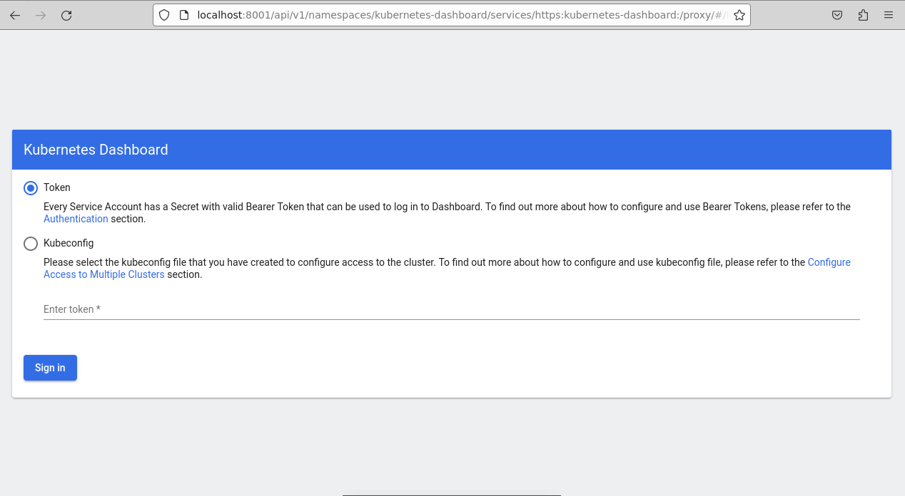

#### 2.1.2 Namespace

The first step is to create a Namespace resource named `cep-project1` so we can deploy all the other resources inside this Namespace

To do this, we will simply run this command

```bash
kubectl create namespace cep-project1
```

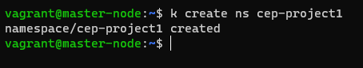

#### 2.1.3 Service Account

Next, we create a Service Account named `sandry`. Service Accounts work like a user for internal services. They are an internal part of RBAC implementation in Kubernetes.

Service Accounts should be Namespace-scoped. Here, we will create it inside our already created namespace.

```bash
kubectl create serviceaccount sandry --namespace cep-project1
```

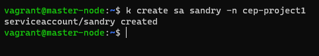

Note that by default, a Service Account will not have any permissions. Permissions in Kubernetes RBAC are managed using Roles and Rolebindings, which is what we will be creating next.

#### 2.1.4 Role

Kubernetes provides a few user-facing roles out-of-the-box. We can directly bind our user to one of these roles, eliminating the need to create a separate role.

We have to assign an `cluster-admin` role to `sandry`. This is because we will be working with PV and PVC that is bound to an NFS. Since PV and PVC are not namespace-scoped, we cannot use the standard role and role binding as our user will not be able to work with the volumes.

```bash
kubectl create clusterrolebinding sandry-access --serviceaccount=cep-project1:sandry --clusterrole=cluster-admin
```

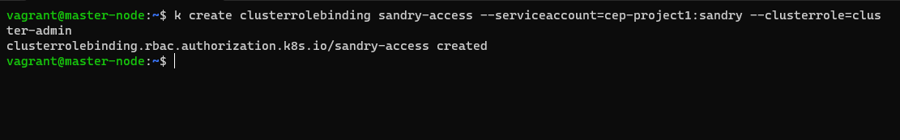

#### 2.1.5 Token & Dashboard Login

Now, to enable this Service Account to access the dashboard, we have to generate a token.

```bash
kubectl create token sandry -n cep-project1
```

This will an output similar to this.

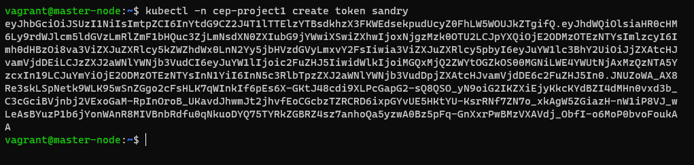

Now let's use this token to login to the dashboard.

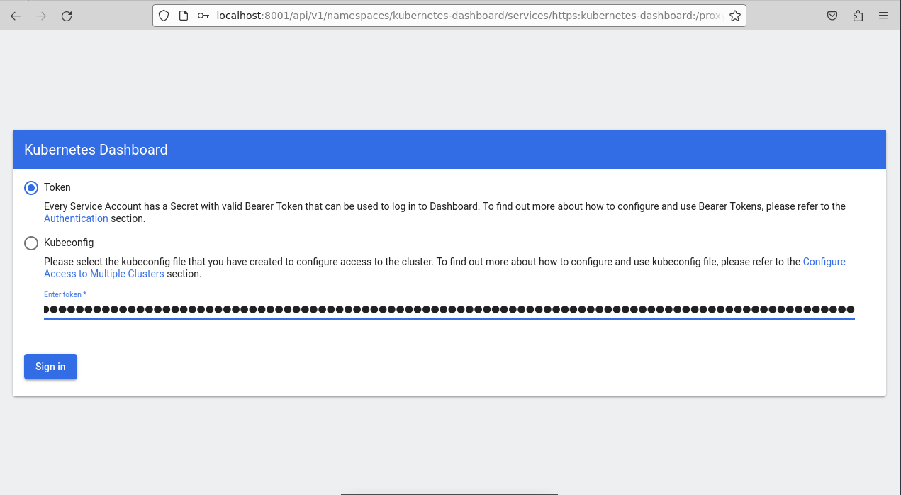

Let's verify if the user is correct.

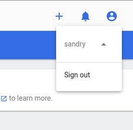

As we can see, the user is `sandry`, which is what we want to use for the remaining part of this tutorial.

#### 2.1.6 Resource Quota

We need to keep a maximum of 3 Services and 3 Pods inside this namespace as a hard cap. To achieve this, we will use this ResourceQuota manifest.

```bash
nano wp-mysql-res-quota.yaml
```

```yaml
apiVersion: v1
kind: ResourceQuota
metadata:
 name: object-counts
 namespace: cep-project1
spec:
 hard: 
   pods: "3"
   services: "3"
   count/deployments.apps: "2"
   count/replicasets.apps: "2"
```

Once this YAML is created, we need to apply it.

```bash
kubectl apply -f wp-mysql-res-quota.yaml
```

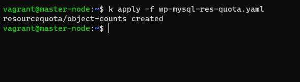

### 2.2 Preparing the NFS Server

The NFS Kernel Server app enables the interface between the serving VM and the client VMs. In this case, we will use Node 03 (called nfs in my cluster) as the NFS Server. The Master Node and Worker-Node01 will then be the NFS clients that will utilise the storage available on NFS VM.

#### 2.2.1 Install NFS Kernel Server

On the NFS designated VM, use the following to install the app

```bash
sudo apt install nfs-kernel-server
```

#### 2.2.2 Create Export Directory

This is the shared directory on the NFS VM that will be accessible to the client VMs for use.

```bash
sudo mkdir -p /mnt/nfs-shared
```

Note that this is a 'Parent' shared folder. Any folders created inside this folder are accessible to all clients by default.

Now, we will remove restrictive permissions from this folder so our clients can access it.

```bash
sudo chown nobody:nogroup /mnt/nfs-shared
sudo chmod 777 /mnt/nfs-shared
```

#### 2.2.3 NFS Export File

The export file details out which IP/subnets can access the NFS server and what actions can they perform on it. Open the file using this command.

```bash
sudo nano /etc/exports
```

Now, we will add access for our client VMs and save the exports file.

> Update: Using these permissions, our MySQL Pod was going into a CrashLoopBackOff. After a bit of searching, here is what to do before you deploy your MySQL deployment.

Login to your NFS Server and change the permissions of the folder which is supposed to be mounted by the MySQL pod.

```bash
sudo chown 999:999 -R /path/to/mysql/shared/directory
```

> Note: 999:999 is usually the user:group for MySQL owner. If you are not sure, you can first deploy the pod, exec into the container and check for the owner.
>
> ```bash
> kubectl exec -it <podname> -n <namespace> -- /bin/bash
> ```
>
> Once you are inside the container, use the following command to find the owner.
>
> ``` bash
> cat /etc/passwd | tain -n
> # replace n with a number of lines, for eg. 5 should usually work.
> ```
>
> Note the user ID and group ID of the **mysql** user.

In our case, this path is `/mnt/nfs-shared/db`. So change yours accordingly.

By doing this, you will avoid the need to use `no_root_squash` in the export file permissions, as this allows root access and is extremely dangerous and absolutely [not recommended](https://access.redhat.com/documentation/en-us/red_hat_enterprise_linux/4/html/security_guide/s2-server-nfs-noroot).

```ini
/mnt/nfs-shared 10.1.0.10/24(rw,sync,no_subtree_check)
```

> Here is what these permissions mean
>
> ```
> rw: read and write operations
> sync: write any change to the disc before applying it
> no_subtree_check: prevent subtree checking
> ```

#### 2.2.4 Export the Shared Folder

Once we export this shared folder, it will become live on the network with the correct firewall settings

```bash
sudo exportfs -a
```

For the configurations to become live, we have to restart the NFS Kernel Server

```bash
sudo systemctl restart nfs-kernel-server
```

#### 2.2.5 Firewall Rules

If your VM has an active firewall, it will be necessary to allow traffic to your NFS server. If you are not sure about the firewall status, you can check using this in Ubuntu.

```bash
sudo ufw status
```

Add the following rule to allow traffic

```bash
sudo ufw allow from x.x.x.x/x to any port nfs
# Replace with your own Subnet
```

#### 2.2.6 Client App

Now that our NFS server is set up, we need to install an app on our clients for the communication

```bash
sudo apt install nfs-common
```

### 2.3 Creating Volumes mapped to the NFS

#### 2.3.1 PersistentVolume

Let's first create the PV that will be used by our database. This is what the YAML looks like.

```yaml
kind: PersistentVolume
apiVersion: v1
metadata:
   name: mysql-pv
spec:
  storageClassName: manual
  accessModes:
    - ReadWriteOnce
  capacity:
    storage: 1Gi
  nfs:
    path: /mnt/nfs-shared/db
    server: 10.1.0.12
    readOnly: false
```

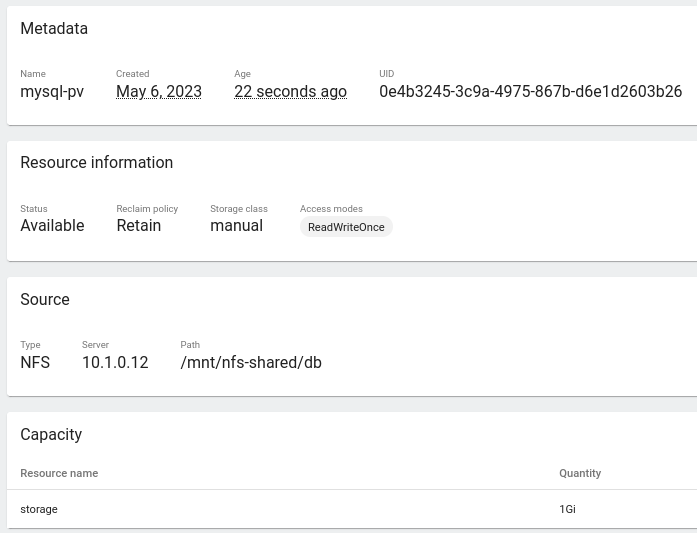

And then the PV that will be used by WordPress

```yaml
kind: PersistentVolume
apiVersion: v1
metadata:
   name: wp-app-pv
spec:
  storageClassName: manual
  accessModes:
    - ReadWriteOnce
  capacity:
    storage: 1Gi
  nfs:
    path: /mnt/nfs-shared/wp
    server: 10.1.0.12
    readOnly: false
```

Once the volumes are created, we will create the claims.

#### 2.3.2 PersistentVolumeClaim

Now, we will create the PersistentVolumeClaim for both WordPress App and MySQL database. Add the following to the YAML. Make sure you are creating the PVCs inside the namespace `cep-project1`.

```yaml
kind: PersistentVolumeClaim
apiVersion: v1
metadata:
  name: mysql-claim
spec:
  storageClassName: manual
  volumeName: mysql-pv
  accessModes:
    - ReadWriteOnce
  resources:
    requests:
      storage: 1Gi
```

Here is the Claim created

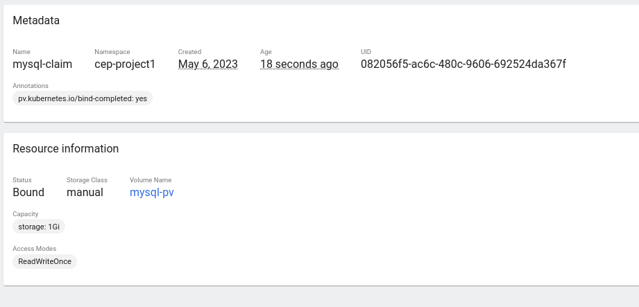

Similarly, we will create a PVC for WordPress

```yaml
kind: PersistentVolumeClaim
apiVersion: v1
metadata:
  name: wp-app-claim
spec:
  storageClassName: manual
  volumeName: wp-app-pv
  accessModes:
    - ReadWriteOnce
  resources:
    requests:
      storage: 1Gi
```

### 2.4 Creating ConfigMap and Secrets

We will create a Secret resource that will be used to authenticate with the MySQL Database. We have to base encode our string.

```bash
echo -n 'my-random-password' | base64
```

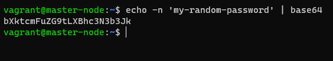

> The password in the image is different from the YAML because that was only for illustration. I am using a different password.

```yaml
kind: Secret
apiVersion: v1
metadata:
  name: mysql-pass
#  namespace: cep-project1
stringData:
  password: "c9%+gjMpLsN23-PGbx%RX%_J"
```

Now let's create this resource from the dashboard. Note that we have commented out the namespace as in the dashboard, we will select the namespace from the dropdown and create resource there.

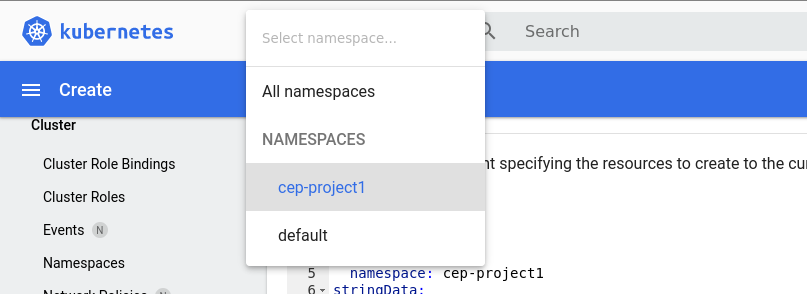

Click on the `+` on the top right to create a resource and paste our YAML content.

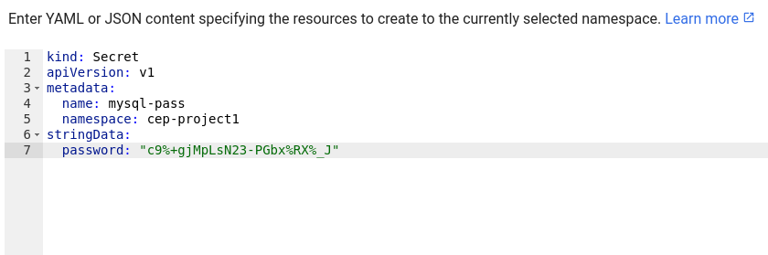

Click on Upload. The page will reload and we can see the Secret created.

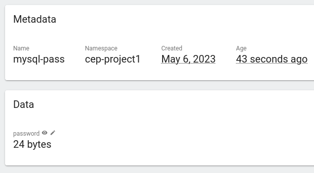

### 2.5 WordPress and MySQL Deployment

And finally, we will deploy the MySQL and WordPress deployments.

#### 2.5.1 MySQL Deployment

We will have to create a service that will expose the DB to the app. Note that since we do not need the DB to be exposed anywhere else, we will create a [headless service](https://blog.knoldus.com/what-is-headless-service-setup-a-service-in-kubernetes/).

```yaml
# MySQL Headless Service
---
apiVersion: v1
kind: Service
metadata:
  name: mysql
  namespace: cep-project1
  labels:
    app: wordpress
spec:
  # This creates a headless service
  clusterIP: None
  ports:
    - port: 3306
      targetPort: 3306
  selector:
    app: wp-mysql
```

Now we will deploy the MySQL app.

```yaml
# MySQL App Deployment
---
apiVersion: apps/v1
kind: Deployment
metadata:
  name: mysql
  namespace: cep-project1
  labels:
    app: wordpress
spec:
  replicas: 1
  selector:
    matchLabels:
      app: wordpress
  template:
    metadata:
      labels:
        app: wordpress
    spec:
      containers:
        - image: mysql:8
          name: mysql
          env:
            - name: MYSQL_ROOT_PASSWORD
              valueFrom:
                secretKeyRef:
                   name: mysql-pass
                   key: password
          ports:
            - containerPort: 3306
              name: mysql
          volumeMounts:
            - name: mysql-persistent-storage
              mountPath: /var/lib/mysql
      volumes:
        - name: mysql-persistent-storage
          persistentVolumeClaim:
            claimName: mysql-claim
```

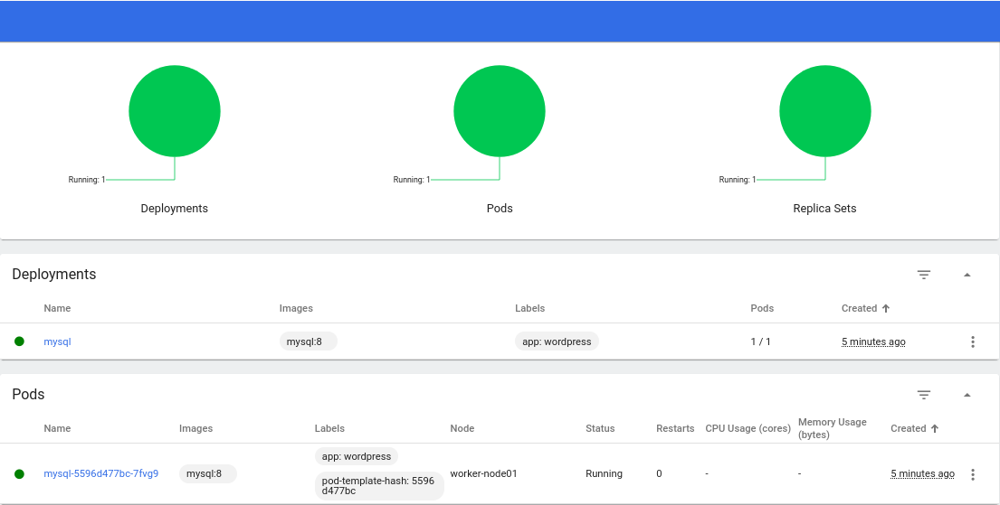

Next, we need to create the service to expose our WordPress application

```yaml
apiVersion: v1
kind: Service
metadata:
  namespace: cep-project1
  labels:
    app: wordpress
  name: wordpress
spec:
  type: NodePort
  ports:
    - port: 80
      targetPort: 80
      protocol: TCP
  selector:
    app: wordpress
```

And finally, we will create the WordPress deployment

```yaml
apiVersion: apps/v1
kind: Deployment
metadata:
  name: wordpress
  namespace: cep-project1
  labels:
    app: wordpress
spec:
  replicas: 1
  selector:
    matchLabels:
      app: wordpress
  template:
    metadata:
      labels:
        app: wordpress
    spec:
      containers:
        - image: wordpress
          name: wordpress
          env:
          - name: WORDPRESS_DB_HOST
            value: mysql
          - name: WORDPRESS_DB_PASSWORD
            valueFrom:
              secretKeyRef:
                name: mysql-pass
                key: password
          ports:
            - containerPort: 80
              name: wordpress
```

As we can see from this image, both our WordPress and MySQL deployments are now ready and available.

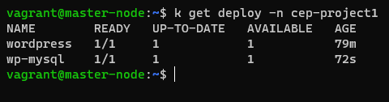

## 3 Troubleshooting

While everything seemed to go as plan, I ran into the first roadblock pretty much immediately. WordPress could not connect to the MySQL Database.

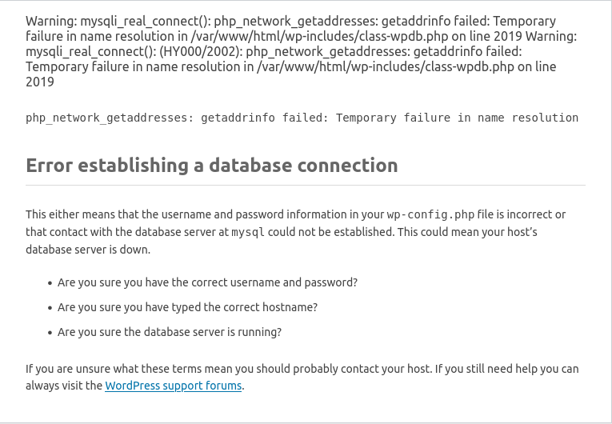

I tried a lot of solutions which were focused on getting WordPress to connect with MySQL correctly, including modifying the `wp-config.php` file to ensure correct credentials are present and that the database host is configured correctly.

But nothing seemed to work. Until something clicked. "Temporary failure in name resolution". Then, I checked the logs for the WordPress container.

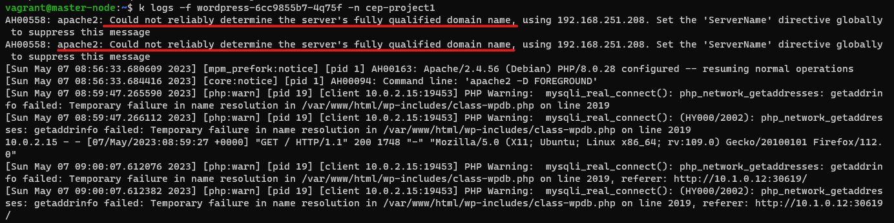

Turns out, even Apache was having trouble determining the FQDN of my WordPress pod. What's happening? We need to check the CoreDNS pods.

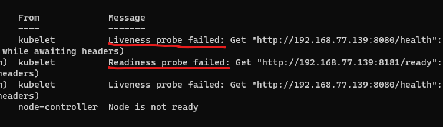

Sure enough, the CoreDNS service isn't working. Something is wrong with the CNI configuration. Upon further investigation, I realised that a Calico Pod was failing a readiness probe on one node, even though describing all the nodes individually showed that Calico was running on the node.

So I deleted the entire Calico installation to start from scratch and re-applied a new manifest.

```bash
curl https://raw.githubusercontent.com/projectcalico/calico/v3.25.1/manifests/calico.yaml -O
```

Now, all the nodes were running a Calico pod and the CoreDNS pods were finally healthy.

But WordPress would stiff refuse to connect to the database. Upon further close inspection, it turns out our Service for exposing the database was configured with the wrong Selector.

### 3.1 Docker & Environment Variables for WordPress & MySQL

Finally after making sure all of the configuration was in place, WordPress still refused to connect to the Database.

This was because our Environment Variables were not being copied in to the final `wp-config.php` which was still being served with `example username` and `example password` and the default DB name and Host.

While I have not found out why this happens, for now, I manually edited the `wp-config.php` file with the correct credentials.

And, then it turned out that our user still did not have enough privileges to connect to the database as the `wordpress@x.x.x.x.` user, despite using a password. To overcome this, we would need to access the MySQL pod and manually adding the user.

### 3.2 MySQL User

First, we will exec into the MySQL Pod

```bash
kubectl exec -it mysql-684cf5bc55-d76jh -n cep-project1 -- /bin/bash
```

Once logged in, we need to login as the `root` user.

```mysql
mysql -u root -p
```

Here, it asks for the password. We will input the same password that we used in our YAML manifests.

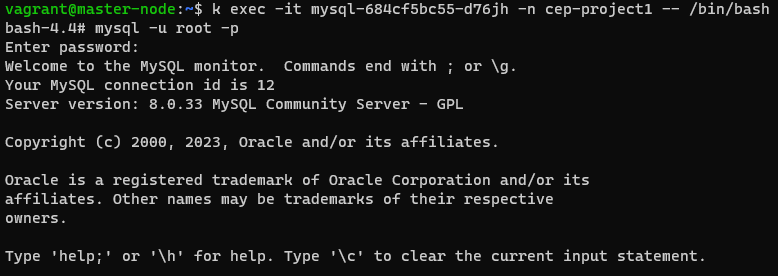

Now, we will create our `wordpress` user and grant the user privileges to read and write to the database.

```mysql
CREATE USER 'wordpress'@'%' IDENTIFIED BY 'pilgrim12345';
```

Then we will grant privileges to the user

```mysql
grant all privileges on *.* to 'wordpress'@'%' with grant option;
```

And then, we have to refresh the permissions

```mysql
FLUSH PRIVILEGES;
```

And finally, we will now be able to access our WordPress app, using our Node IP and NodePort provisioned port number, 32556 in this case.


